# LeetCode Solutions

Welcome to my personal archive of LeetCode solutions! This repository serves as a showcase of optimized, clean, and well-structured implementations of common algorithmic problems, focusing primarily on Tree structures and Dynamic Programming.

All solutions are written in Python, adhering to standard naming conventions, visual layouts, and optimal time/space complexity guidelines.

## 📊 Performance & Progress Dashboard

## 📂 Folder Structure

* `Easy/` - Solutions to introductory tree algorithms and foundational DP concepts.
* `Medium/` - Solutions requiring more complex data states, tree traversals, and memoized structures.

## 🏆 Completed Challenges Index

| # | Problem Title | Topic | Difficulty | Solution Link |
|---|---|---|---|---|
| 1 | Invert Binary Tree | Trees | **Easy** | [View Solution](./Easy/invert-binary-tree.py) |
| 2 | Climbing Stairs | Dynamic Programming | **Easy** | [View Solution](./Easy/climbing-stairs.py) |
| 3 | House Robber | Dynamic Programming | **Medium** | [View Solution](./Medium/house-robber.py) |
| 4 | Maximum Depth of Binary Tree | Trees | **Easy** | [View Solution](./Easy/maximum-depth-of-binary-tree.py) |
| 5 | Symmetric Tree | Trees | **Easy** | [View Solution](./Easy/symmetric-tree.py) |
| 6 | Longest Palindromic Substring | Dynamic Programming | **Medium** | [View Solution](./Medium/longest-palindromic-substring.py) |
| 7 | Subtree of Another Tree | Trees | **Easy** | [View Solution](./Easy/subtree-of-another-tree.py) |
| 8 | Same Tree | Trees | **Easy** | [View Solution](./Easy/same-tree.py) |
| 9 | Unique Paths | Dynamic Programming | **Medium** | [View Solution](./Medium/unique-paths.py) |
| 10 | Coin Change | Dynamic Programming | **Medium** | [View Solution](./Medium/coin-change.py) |
| 11 | House Robber | Dynamic Programming | **Medium** | [View Solution](./Medium/house-robber.py) |
| 12 | Invert Binary Tree | Trees | **Easy** | [View Solution](./Easy/invert-binary-tree.py) |
| 13 | Decode Ways | Dynamic Programming | **Medium** | [View Solution](./Medium/decode-ways.py) |
| 14 | Word Break | Dynamic Programming | **Medium** | [View Solution](./Medium/word-break.py) |

*This repository is automatically updated after every daily challenge solves.*
