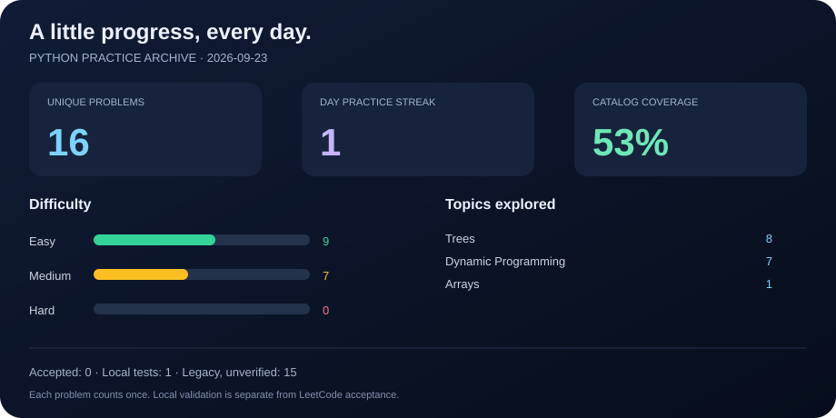

# LeetCode Solutions

Python solutions, organized by difficulty, with an honest record of practice and validation.

<!-- leetcode-progress:start -->
## Practice progress

**25 unique problems archived** · **7 day practice streak** · **25/30 catalog problems completed**

| Evidence | Problems |
| :--- | ---: |
| Legacy (unverified) | 15 |
| Local tests passed | 10 |
| LeetCode Accepted | 0 |

Local tests do not establish a LeetCode Accepted verdict. Legacy records lack preserved judge evidence. The streak counts the first recorded completion of each unique problem; it is a practice streak, not a LeetCode account streak.

### Difficulty & topics

| Difficulty | Problems |
| :--- | ---: |
| Easy | 17 |
| Medium | 8 |
| Hard | 0 |

| Topic | Problems |
| :--- | ---: |
| Trees | 8 |
| Dynamic Programming | 7 |
| Arrays | 2 |
| Binary Search | 2 |
| Hash Tables | 2 |
| Bit Manipulation | 1 |
| Sliding Window | 1 |
| Stacks | 1 |
| Strings | 1 |

### Solution index

| Problem | Difficulty | Topics | Evidence | First completed | Python |
| :--- | :--- | :--- | :--- | :--- | :--- |
| [Two Sum](https://leetcode.com/problems/two-sum/) | Easy | Hash Tables | Local tests passed | 2026-10-03 | [Source](Easy/two-sum.py) |
| [Search Insert Position](https://leetcode.com/problems/search-insert-position/) | Easy | Binary Search | Local tests passed | 2026-10-02 | [Source](Easy/search-insert-position.py) |
| [Merge Sorted Array](https://leetcode.com/problems/merge-sorted-array/) | Easy | Arrays | Local tests passed | 2026-10-01 | [Source](Easy/merge-sorted-array.py) |
| [Valid Parentheses](https://leetcode.com/problems/valid-parentheses/) | Easy | Stacks | Local tests passed | 2026-09-30 | [Source](Easy/valid-parentheses.py) |
| [Valid Palindrome](https://leetcode.com/problems/valid-palindrome/) | Easy | Strings | Local tests passed | 2026-09-29 | [Source](Easy/valid-palindrome.py) |
| [Single Number](https://leetcode.com/problems/single-number/) | Easy | Bit Manipulation | Local tests passed | 2026-09-28 | [Source](Easy/single-number.py) |
| [Longest Substring Without Repeating Characters](https://leetcode.com/problems/longest-substring-without-repeating-characters/) | Medium | Sliding Window | Local tests passed | 2026-09-27 | [Source](Medium/longest-substring-without-repeating-characters.py) |
| [Contains Duplicate](https://leetcode.com/problems/contains-duplicate/) | Easy | Hash Tables | Local tests passed | 2026-09-25 | [Source](Easy/contains-duplicate.py) |
| [Binary Search](https://leetcode.com/problems/binary-search/) | Easy | Binary Search | Local tests passed | 2026-09-24 | [Source](Easy/binary-search.py) |
| [Best Time to Buy and Sell Stock](https://leetcode.com/problems/best-time-to-buy-and-sell-stock/) | Easy | Arrays | Local tests passed | 2026-09-23 | [Source](Easy/best-time-to-buy-and-sell-stock.py) |
| [Path Sum](https://leetcode.com/problems/path-sum/) | Easy | Trees | Legacy (unverified) | 2026-08-24 | [Source](Easy/path-sum.py) |
| [Same Tree](https://leetcode.com/problems/same-tree/) | Easy | Trees | Legacy (unverified) | 2026-08-24 | [Source](Easy/same-tree.py) |
| [Minimum Path Sum](https://leetcode.com/problems/minimum-path-sum/) | Medium | Dynamic Programming | Legacy (unverified) | 2026-08-20 | [Source](Medium/minimum-path-sum.py) |
| [Unique Paths](https://leetcode.com/problems/unique-paths/) | Medium | Dynamic Programming | Legacy (unverified) | 2026-08-20 | [Source](Medium/unique-paths.py) |
| [Binary Tree Level Order Traversal](https://leetcode.com/problems/binary-tree-level-order-traversal/) | Medium | Trees | Legacy (unverified) | 2026-08-19 | [Source](Medium/binary-tree-level-order-traversal.py) |
| [Decode Ways](https://leetcode.com/problems/decode-ways/) | Medium | Dynamic Programming | Legacy (unverified) | 2026-08-19 | [Source](Medium/decode-ways.py) |
| [Word Break](https://leetcode.com/problems/word-break/) | Medium | Dynamic Programming | Legacy (unverified) | 2026-08-17 | [Source](Medium/word-break.py) |
| [Subtree of Another Tree](https://leetcode.com/problems/subtree-of-another-tree/) | Easy | Trees | Legacy (unverified) | 2026-08-17 | [Source](Easy/subtree-of-another-tree.py) |
| [Coin Change](https://leetcode.com/problems/coin-change/) | Medium | Dynamic Programming | Legacy (unverified) | 2026-08-14 | [Source](Medium/coin-change.py) |
| [Merge Two Binary Trees](https://leetcode.com/problems/merge-two-binary-trees/) | Easy | Trees | Legacy (unverified) | 2026-08-14 | [Source](Easy/merge-two-binary-trees.py) |
| [Symmetric Tree](https://leetcode.com/problems/symmetric-tree/) | Easy | Trees | Legacy (unverified) | 2026-05-23 | [Source](Easy/symmetric-tree.py) |
| [Maximum Depth of Binary Tree](https://leetcode.com/problems/maximum-depth-of-binary-tree/) | Easy | Trees | Legacy (unverified) | 2026-05-22 | [Source](Easy/maximum-depth-of-binary-tree.py) |
| [House Robber](https://leetcode.com/problems/house-robber/) | Medium | Dynamic Programming | Legacy (unverified) | 2026-05-22 | [Source](Medium/house-robber.py) |
| [Climbing Stairs](https://leetcode.com/problems/climbing-stairs/) | Easy | Dynamic Programming | Legacy (unverified) | 2026-05-22 | [Source](Easy/climbing-stairs.py) |
| [Invert Binary Tree](https://leetcode.com/problems/invert-binary-tree/) | Easy | Trees | Legacy (unverified) | 2026-05-22 | [Source](Easy/invert-binary-tree.py) |

Updated 2026-10-03. Progress is regenerated on each run from the durable [completion journal](progress.json).
<!-- leetcode-progress:end -->
